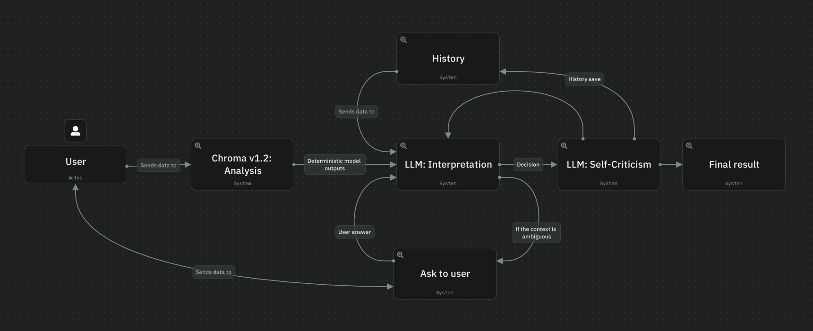

# Agentic LangGraph Workflow

Chroma modelimin ürettiği ham stil/renk metriklerini (dominant palet, uyum skoru, doygunluk, kontrast, stil olasılıkları) **bağlama göre yorumlayan** bir LangGraph agent'ı.

## Neden agentic bir katman

Chroma'nın önceki sürümü, uyum skorunu kullanıcıya açıklayabilmek için yüzlerce satırlık eşik-tabanlı bir metin üretici barındırıyordu. Ama maalesef ki **renk teorisi tek başına bağlamı bilmiyor.** Düşük bir uyum skoru, "Sports" stilinde bilinçli bir monokromatik tercih olabilirken, aynı skor formal bir kombinde gerçek bir sorun olabilir. Sabit kurallarla bu ayrımı yakalamak mümkün olmuyordu.

Bu yüzden yorumlama sorumluluğu tamamen sınırları net çizilmiş bir LLM'e devredildi.

- **LLM skoru iyileştirmeye çalışmaz.** Chroma'nın ürettiği metrikler deterministik ve nihai; LLM'in görevi onları *yorumlamak*, yeniden hesaplamaya ya da "daha iyi" göstermeye çalışmak değil.
- **LLM gerektiğinde soru sorar.** Kombinin amacı (iş görüşmesi mi, gündelik mi, spor mu) bilinmeden sağlıklı bir yorum yapılamayacağını düşünürse, kullanıcıya tek bir netleştirici soru yöneltir ve yanıta göre değerlendirmesini günceller.
- **LLM kendini denetler.** İlk yorumdan sonra ayrı bir öz-eleştiri adımı, üretilen metnin ham metriklerle tutarlı olup olmadığını kontrol eder.

## Mimari




Her kutunun sorumluluğu net bir şekilde ayrılmış durumda:

| Node | Tür | Ne yapar |
|---|---|---|
| `run_model` | Deterministik | Chroma'nın ONNX modelini ve renk analiz pipeline'ını doğrudan (aynı process içinde, ağ çağrısı olmadan) çalıştırır |
| `load_history` | Deterministik | Cihazın son 5 analizinin kompakt özetini okur |
| `contextual_interpret` | LLM | Ham metrikleri, geçmişi ve (varsa) kullanıcı bağlamını birlikte okuyup yorumlar; gerekirse netleştirici soru üretir |
| `ask_user` | İnsan-döngüde | `interrupt()` ile graph'ı gerçekten durdurup kullanıcı yanıtını bekler |
| `self_criticism` | LLM | Taslak yorumu ham metriklerle karşılaştırıp tutarlılığını denetler |
| `update_history` | Deterministik | Nihai sonucun kompakt özetini geçmişe yazar |

## Tasarım ilkeleri

1. Chroma deterministik metrik üretir, LLM sadece bu metrikleri bağlama oturtur. LLM hiçbir zaman kendi renk matematiğini uydurmaz.
2. `ask_user` bir kez tetiklendiğinde, `contextual_interpret` ikinci kez soru soramaz, bu garanti, LLM'in olasılıksal kararına bırakılamayacağından, işi garantiye alan bir bayrağa (`clarification_asked`) dayanıyor.
3. Geçmiş, ham analiz sonuçlarının tamamını saklamaz. LLM'in ürettiği tek satırlık özetleri saklar, hem prompt boyutunu hem maliyeti kontrol altında tutar.
4. LLM çağrıları Groq ve Gemini arasında otomatik fallback ile çalışıyor. (`ChatModel.with_fallbacks`) bir sağlayıcı rate limit'e takılır ya da kesinti yaşarsa sistem kesintisiz devam ediyor.

## Proje yapısı

```
agentic/
├── main.py          # FastAPI backend
├── analysis.py       # Chroma'nın çerçeveden bağımsız görüntü/renk analiz mantığı
├── graph.py           # StateGraph tanımı, node/edge bağlantıları
├── state.py            # Graph boyunca taşınan state şeması
├── nodes.py             # Node fonksiyonları
├── prompts.py            # LLM sistem promptları ve yapılandırılmış çıktı şemaları
├── tools.py               # Chroma'yı çağıran sarmalayıcı
├── history.py              # Cihaz bazlı geçmiş katmanı
├── checkpointer.py          # Oturum kalıcılığı
├── config.py                 # LLM sağlayıcı seçimi ve fallback mantığı
└── requirements.txt
```

## Bilinen sınırlar

- SQLite tabanlı checkpointer/history, tek process'lik dağıtımlar için. Yatay ölçeklendirme gerektiğinde elbette `PostgresSaver`'a geçiş gerekecektir.
- `ask_user` adımı, `interrupt()` mekanizmasıyla çalıştığı için durum bilgisiz (stateless) bir dağıtım modeliyle uyumlu değildir. Çalıştığı sürecin checkpointer'a erişimi kesintisiz olmalıdır.
